# Use Case Diagram Sistem Manajemen Laporan Kerja PLN Galesong

## Diagram Use Case

```mermaid
graph TB
    subgraph "Aplikasi PLN Galesong"
        %% Use Case Login
        UC0[Login]
        
        %% Use Cases untuk Atasan
        UC1[Lihat Dashboard]
        UC2[Kelola Data Kelompok]
        UC3[Kelola Data Karyawan]
        UC4[Pemantauan Laporan]
        UC5[Pemantauan Job Pekerjaan]
        UC6[Generate Prediksi]
        UC7[Lihat Statistik]
        UC8[Export Data]
        UC9[Kelola Excel]
        UC10[Pengaturan Admin]
        
        %% Use Cases untuk Karyawan
        UC11[Lihat Dashboard Kelompok]
        UC12[Input Laporan Kerja]
        UC13[Input Job Pekerjaan]
        UC14[Export Data Kelompok]
        UC15[Pengaturan Kelompok]
    end
    
    %% Actors
    Atasan[Atasan<br/>Admin]
    Karyawan[Karyawan<br/>Kelompok]
    
    %% Relationships Login
    Atasan --> UC0
    Karyawan --> UC0
    
    %% Relationships Atasan
    Atasan --> UC1
    Atasan --> UC2
    Atasan --> UC3
    Atasan --> UC4
    Atasan --> UC5
    Atasan --> UC6
    Atasan --> UC7
    Atasan --> UC8
    Atasan --> UC9
    Atasan --> UC10
    
    %% Relationships Karyawan
    Karyawan --> UC11
    Karyawan --> UC12
    Karyawan --> UC13
    Karyawan --> UC14
    Karyawan --> UC15
    
    style Atasan fill:#4A90E2,stroke:#2E5C8A,stroke-width:2px,color:#fff
    style Karyawan fill:#50C878,stroke:#2E7D4E,stroke-width:2px,color:#fff
    style UC1 fill:#E8F4F8,stroke:#4A90E2,stroke-width:2px
    style UC2 fill:#E8F4F8,stroke:#4A90E2,stroke-width:2px
    style UC3 fill:#E8F4F8,stroke:#4A90E2,stroke-width:2px
    style UC4 fill:#E8F4F8,stroke:#4A90E2,stroke-width:2px
    style UC5 fill:#E8F4F8,stroke:#4A90E2,stroke-width:2px
    style UC6 fill:#E8F4F8,stroke:#4A90E2,stroke-width:2px
    style UC7 fill:#E8F4F8,stroke:#4A90E2,stroke-width:2px
    style UC8 fill:#E8F4F8,stroke:#4A90E2,stroke-width:2px
    style UC9 fill:#E8F4F8,stroke:#4A90E2,stroke-width:2px
    style UC10 fill:#E8F4F8,stroke:#4A90E2,stroke-width:2px
    style UC11 fill:#E8F8E8,stroke:#50C878,stroke-width:2px
    style UC12 fill:#E8F8E8,stroke:#50C878,stroke-width:2px
    style UC13 fill:#E8F8E8,stroke:#50C878,stroke-width:2px
    style UC14 fill:#E8F8E8,stroke:#50C878,stroke-width:2px
    style UC15 fill:#E8F8E8,stroke:#50C878,stroke-width:2px
    style UC0 fill:#FFF4E6,stroke:#FF9800,stroke-width:2px
```



## Deskripsi Use Case

### Use Case: Login (Digunakan oleh Semua Aktor)

**Login**
- Deskripsi: Baik Atasan maupun Karyawan harus melakukan proses login terlebih dahulu dengan memasukkan username dan password untuk mengakses sistem. Setelah berhasil login, sistem akan mengarahkan pengguna ke dashboard sesuai dengan peran mereka masing-masing (Atasan atau Karyawan).
- Prioritas: Tinggi
- Aktor: Atasan, Karyawan

### Actor: Atasan (Admin)

1. **Lihat Dashboard**
   - Deskripsi: Atasan dapat melihat dashboard dengan statistik lengkap tentang laporan, karyawan, dan kelompok
   - Prioritas: Tinggi

2. **Kelola Data Kelompok**
   - Deskripsi: Atasan dapat membuat, membaca, memperbarui, dan menghapus data kelompok kerja
   - Prioritas: Tinggi

3. **Kelola Data Karyawan**
   - Deskripsi: Atasan dapat membuat, membaca, memperbarui, dan menghapus data karyawan
   - Prioritas: Tinggi

4. **Pemantauan Laporan**
   - Deskripsi: Atasan dapat melihat, memfilter, dan memantau semua laporan kerja dari semua kelompok
   - Prioritas: Tinggi

5. **Pemantauan Job Pekerjaan**
   - Deskripsi: Atasan dapat melihat, memfilter, dan memantau semua job pekerjaan dari semua kelompok
   - Prioritas: Sedang

6. **Generate Prediksi**
   - Deskripsi: Atasan dapat menghasilkan prediksi berdasarkan data laporan dan job pekerjaan
   - Prioritas: Sedang

7. **Lihat Statistik**
   - Deskripsi: Atasan dapat melihat statistik detail dan grafik analisis data
   - Prioritas: Sedang

8. **Export Data**
   - Deskripsi: Atasan dapat mengekspor data ke format Excel untuk keperluan laporan
   - Prioritas: Sedang

9. **Kelola Excel**
   - Deskripsi: Atasan dapat mengunggah, mengelola, dan mengunduh file Excel
   - Prioritas: Rendah

10. **Pengaturan Admin**
    - Deskripsi: Atasan dapat mengatur profil, pengaturan sistem, dan konfigurasi aplikasi
    - Prioritas: Rendah

### Actor: Karyawan (Kelompok)

1. **Lihat Dashboard Kelompok**
   - Deskripsi: Karyawan dapat melihat dashboard personal dengan statistik kelompok mereka
   - Prioritas: Tinggi

2. **Input Laporan Kerja**
   - Deskripsi: Karyawan dapat membuat, melihat, mengedit, dan menghapus laporan kerja harian
   - Prioritas: Tinggi

3. **Input Job Pekerjaan**
   - Deskripsi: Karyawan dapat membuat, melihat, mengedit, dan menghapus job pekerjaan
   - Prioritas: Tinggi

4. **Export Data Kelompok**
   - Deskripsi: Karyawan dapat mengekspor data laporan dan job pekerjaan kelompok mereka ke format Excel untuk keperluan dokumentasi dan pelaporan
   - Prioritas: Sedang

5. **Pengaturan Kelompok**
   - Deskripsi: Karyawan dapat mengatur profil kelompok, akun, dan notifikasi
   - Prioritas: Rendah

## Diagram Use Case (Format UML Standar)

Berikut adalah representasi use case diagram dalam format teks yang lebih standar:

```
┌─────────────────────────────────────────────────────────────┐
│              Aplikasi PLN Galesong                          │
├─────────────────────────────────────────────────────────────┤
│                                                              │
│  ┌──────────────────┐         ┌──────────────────┐         │
│  │   Atasan         │         │   Karyawan        │         │
│  │   (Admin)       │         │   (Kelompok)      │         │
│  └────────┬─────────┘         └────────┬─────────┘         │
│           │                            │                   │
│           │                            │                   │
│           └────────────┬───────────────┘                   │
│                        │                                    │
│                 ┌──────▼──────┐                             │
│                 │    Login    │                             │
│                 └─────────────┘                             │
│                                                              │
│  ┌──────────────────┐         ┌──────────────────┐         │
│  │ Lihat Dashboard  │         │ Lihat Dashboard  │         │
│  └──────────────────┘         │ Kelompok          │         │
│                                └──────────────────┘         │
│  ┌──────────────────┐         ┌──────────────────┐         │
│  │ Kelola Kelompok  │         │ Input Laporan     │         │
│  └──────────────────┘         └──────────────────┘         │
│                                                              │
│  ┌──────────────────┐         ┌──────────────────┐         │
│  │ Kelola Karyawan  │         │ Input Job        │         │
│  └──────────────────┘         │ Pekerjaan         │         │
│                                └──────────────────┘         │
│  ┌──────────────────┐         ┌──────────────────┐         │
│  │ Pemantauan       │         │ Export Data      │         │
│  │ Laporan          │         │ Kelompok         │         │
│  └──────────────────┘         └──────────────────┘         │
│                                                              │
│  ┌──────────────────┐         ┌──────────────────┐         │
│  │ Pemantauan Job   │         │ Pengaturan       │         │
│  │ Pekerjaan        │         │ Kelompok         │         │
│  └──────────────────┘         └──────────────────┘         │
│                                                              │
│  ┌──────────────────┐                                       │
│  │ Generate Prediksi│                                       │
│  └──────────────────┘                                       │
│                                                              │
│  ┌──────────────────┐                                       │
│  │ Lihat Statistik  │                                       │
│  └──────────────────┘                                       │
│                                                              │
│  ┌──────────────────┐                                       │
│  │ Export Data      │                                       │
│  └──────────────────┘                                       │
│                                                              │
│  ┌──────────────────┐                                       │
│  │ Kelola Excel     │                                       │
│  └──────────────────┘                                       │
│                                                              │
│  ┌──────────────────┐                                       │
│  │ Pengaturan Admin │                                       │
│  └──────────────────┘                                       │
│                                                              │
└─────────────────────────────────────────────────────────────┘
```

## Catatan

- Diagram ini menggambarkan semua fitur utama yang tersedia dalam aplikasi PLN Galesong
- Setiap actor memiliki akses ke use case yang sesuai dengan peran mereka
- Use case diurutkan berdasarkan prioritas dan frekuensi penggunaan

